## Portfólio — Engenharia de Software | FIAP 2026

## Sobre este repositório

Este repositório reúne os exercícios, diagramas UML e implementações desenvolvidas durante as aulas da disciplina de Engenharia de Software da FIAP.

O objetivo deste projeto é demonstrar a evolução prática no desenvolvimento de software, documentação técnica e modelagem de sistemas.

---

# Como executar os exercícios

## Pré-requisitos

- Python 3 instalado
- VSCode ou Google Colab

## Instalação

Clone o repositório:

```bash
git clone LINK_DO_SEU_REPOSITORIO
```

Execute os arquivos Python:

```bash
python nome_do_arquivo.py
```

---

# Exercícios por Aula

## Aula 03 — Requisitos Funcionais vs. Não-Funcionais

### Código

Arquivo:
`aula-03-requisitos/gymtrack_validador.py`

Descrição:
Sistema simples de validação de treino desenvolvido em Python utilizando estruturas condicionais e validações básicas.

### Execução

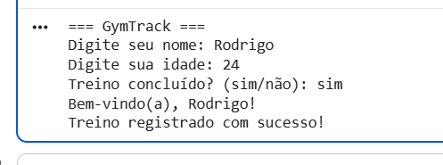

Comentário:
O programa valida informações relacionadas ao treino do usuário e exibe mensagens conforme os dados informados.

---

## Aula 04 — Documento SRS

### Código

Arquivo:
`aula-04-srs/srs_marketplace.py`

Descrição:
Implementação baseada em conceitos de levantamento de requisitos e documentação SRS para um marketplace.

### Execução

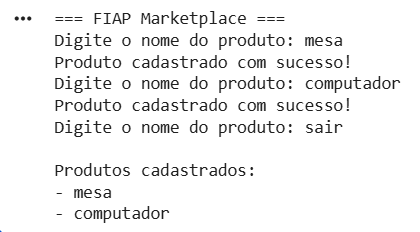

Comentário:
O programa demonstra funcionalidades simuladas do sistema FIAP Marketplace.

---

## Aula 05 — UML e Casos de Uso

### Diagrama

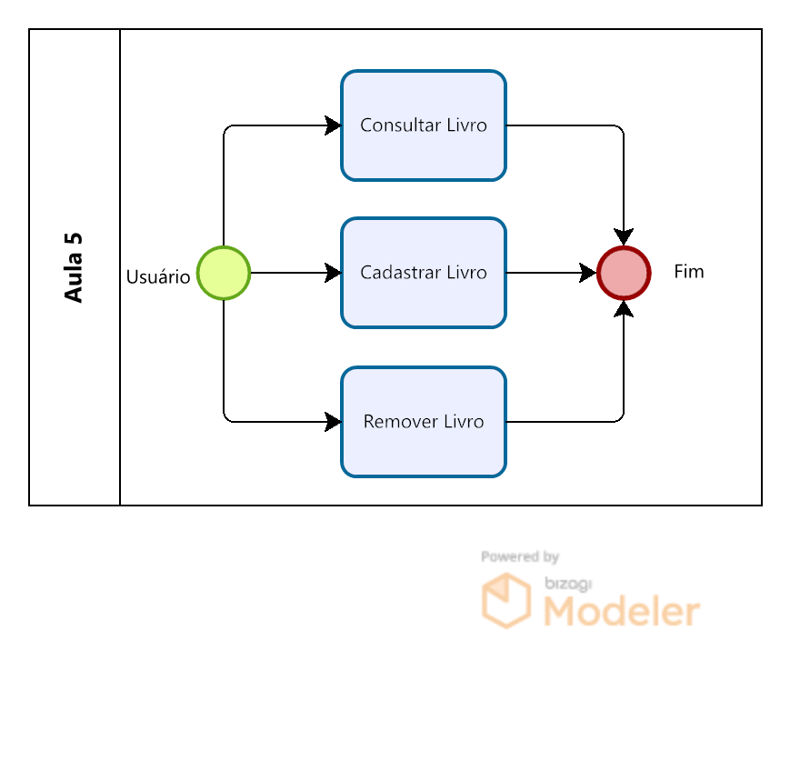

Comentário:
O diagrama representa as interações entre usuários e o sistema de biblioteca digital.

### Código

Arquivo:
`aula-05-casos-de-uso/biblioteca_digital.py`

Descrição:
Sistema de biblioteca digital implementado em Python utilizando conceitos de orientação a objetos.

### Execução

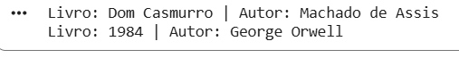

Comentário:
O output demonstra funcionalidades de cadastro e consulta de livros.

---

## Aula 06 — Diagramas de Atividades

### Diagrama

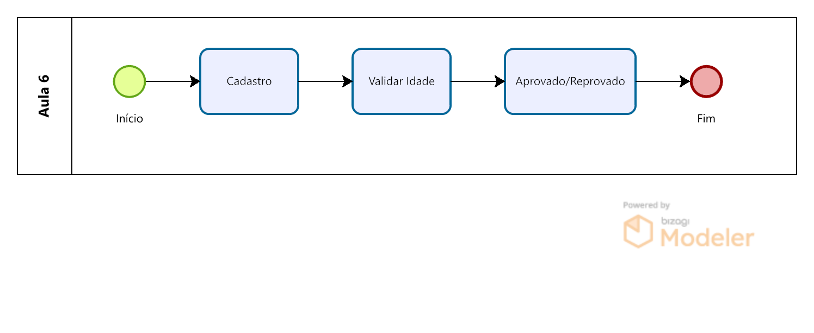

Comentário:
O diagrama representa o fluxo de cadastro e aprovação de usuários utilizando swimlanes.

### Código

Arquivo:
`aula-06-atividades/cadastro_usuario.py`

Descrição:
Sistema de cadastro com aprovação de usuários e validações de entrada.

### Execução

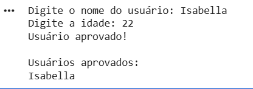

Comentário:
O programa exibe o fluxo de cadastro e aprovação do usuário.

---

## Aula 07 — Diagramas de Sequência

### Diagrama

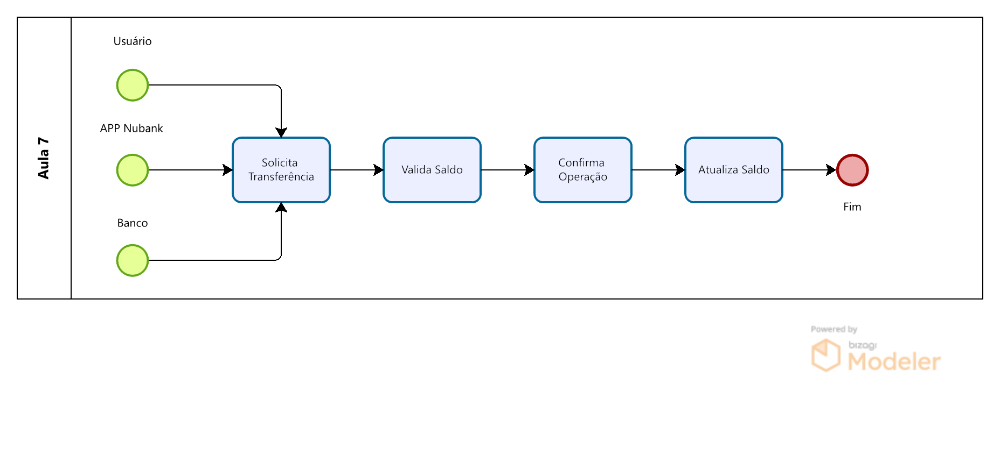

Comentário:
O diagrama demonstra a sequência de mensagens durante uma transferência bancária.

### Código

Arquivo:
`aula-07-sequencia/transferencia_nubank.py`

Descrição:
Simulação de transferência bancária com tratamento de saldo e validações.

### Execução

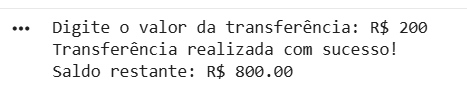

Comentário:
O output demonstra a transferência e atualização do saldo do usuário.

---

## Aula 08 — Diagramas de Classes

### Diagrama

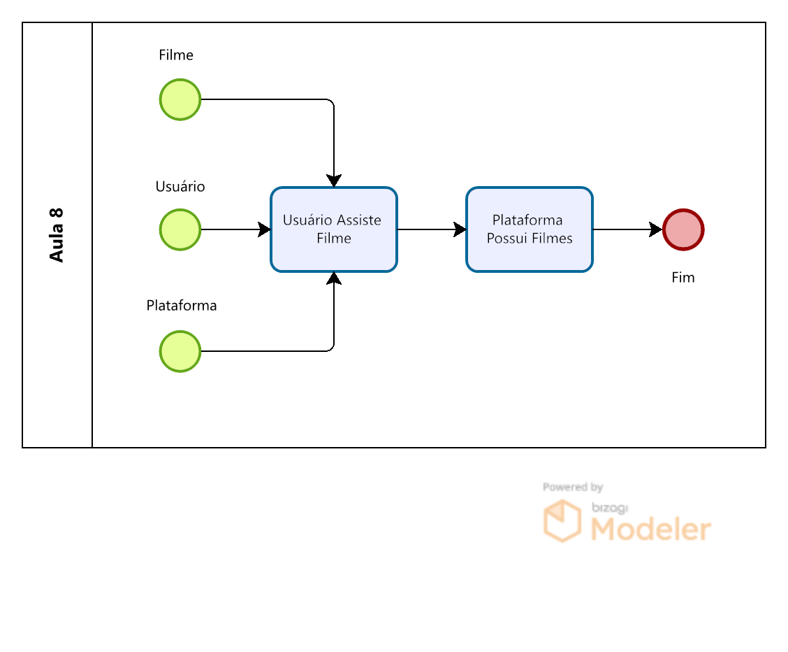

Comentário:
O diagrama representa as classes e relacionamentos de um sistema de streaming.

### Código

Arquivo:
`aula-08-classes/streaming_netflix.py`

Descrição:
Sistema de streaming utilizando classes, herança e encapsulamento.

### Execução

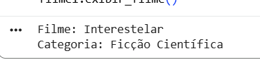

Comentário:
O programa simula funcionalidades básicas de uma plataforma de streaming.

---

## Aula 09 — Arquitetura MVC

### Protótipo

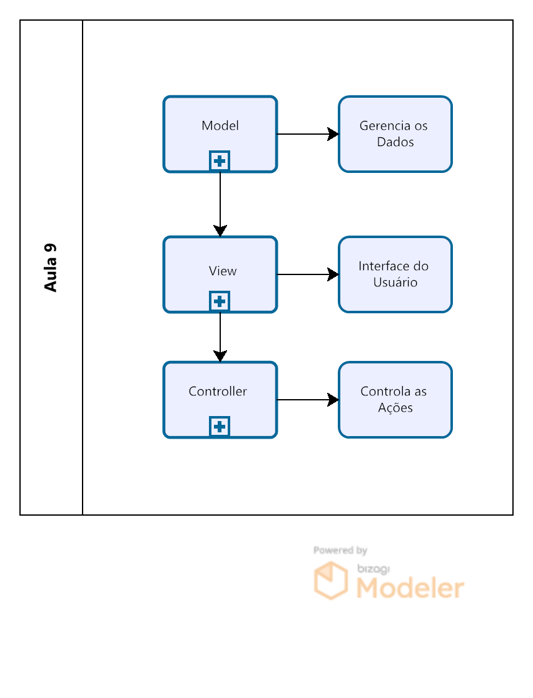

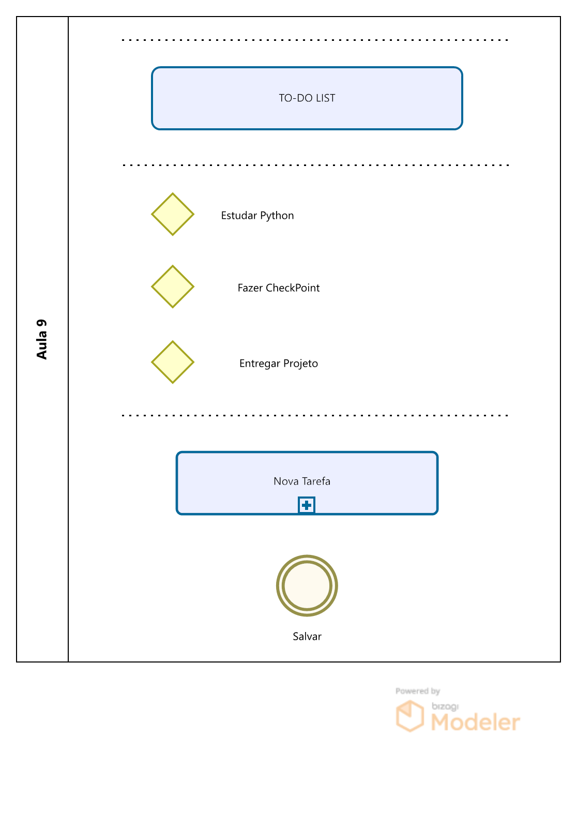

Comentário:
Protótipo de uma aplicação To-Do List utilizando conceitos da arquitetura MVC.

---

# 🔗 Links

- GitHub: LINK_DO_SEU_REPOSITORIO
